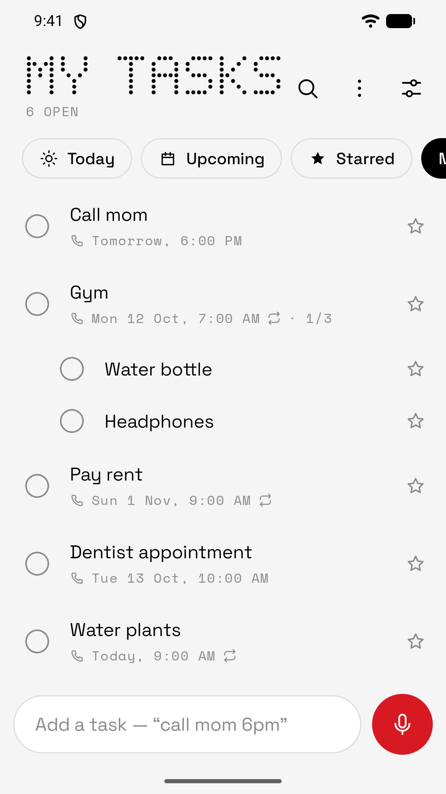
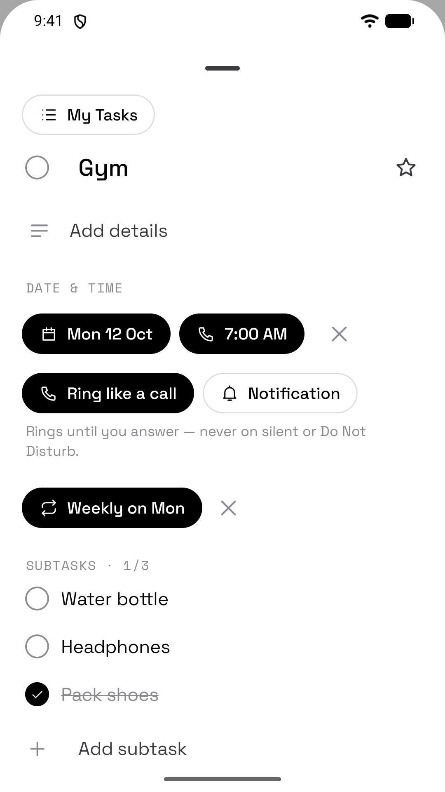
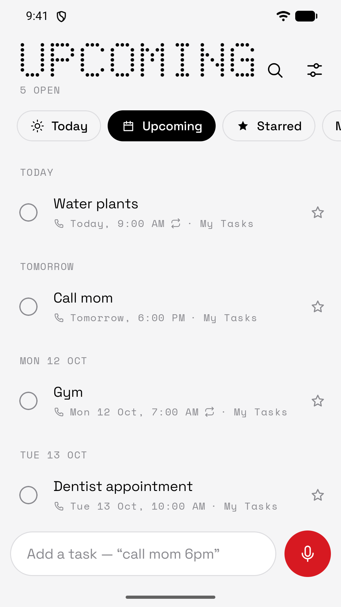
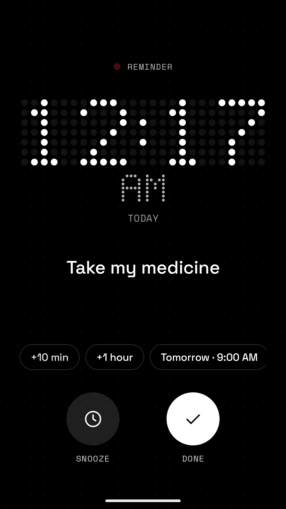
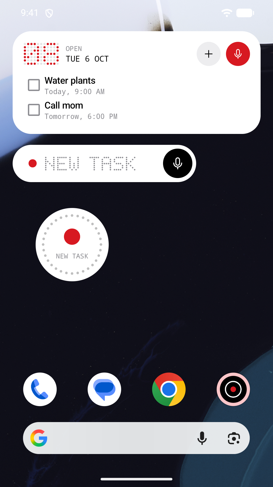

<div align="center">


# Dot

**Private tasks with reminders that ring like a call.**

An end-to-end encrypted to-do list for Android, with a one-tap voice widget and a dot-matrix design.

[](https://github.com/berlinflix/dot-tasks/actions/workflows/ci.yml)
[](https://github.com/berlinflix/dot-tasks/releases/latest)
[](LICENSE)








</div>

## Download

- **APK:** [latest release](https://github.com/berlinflix/dot-tasks/releases/latest), signed, with a SHA-256 checksum next to it.
- **Google Play:** coming soon.

Android 12 or newer. Google Play services are needed for sign-in and sync; everything else works without them.

## Features

**Reminders that get your attention, never at the wrong time**
- Reminders can ring like an incoming call, with a full-screen ring screen over the lock screen, or show as a normal notification.
- **On Silent or Do Not Disturb, Dot never rings.** You get a quiet notification instead.
- One-tap snooze: 10 min, 1 hour, later today, this evening, tomorrow, this or next weekend, next week, or a custom time.
- Unanswered reminders become "missed", or snooze themselves.

**Just say it, or type it**
- Home-screen mic widgets (round or pill), an app shortcut and a Quick Settings tile open voice capture in one tap.
- Speech is recognised **on the phone only**. No audio is recorded or uploaded.
- Natural language everywhere: *"remind me to call mom tomorrow at 8 am"*, *"gym every Monday 7am"*,
  *"pay rent on the 1st of every month"*, *"book club every last Friday of the month at 7 pm"*.
- Share text from any app to Dot to turn it into a task (you confirm before it's saved).

**Everything you'd expect from a task app**
- Lists, subtasks with progress, notes, due dates with optional times.
- Repeating tasks: daily, weekdays, weekly on chosen days, monthly by date or "2nd Tuesday" / "last Friday",
  yearly, every N days/weeks/months/years, ending on a date or after N times. Completing one schedules the next.
- **Today**, **Upcoming** and **Starred** views across all lists.
- Sort each list by your own order (long-press to drag), by date, or by recently starred.
- Search, move between lists, duplicate, share, delete all completed, undo.
- A tasks widget with one-tap complete.

**Private by design**
- Works without an account. Sign in with Google only to back up and sync.
- Synced data is **end-to-end encrypted** on the phone (XChaCha20-Poly1305 via Google Tink). The server
  stores ciphertext only. Your key lives on your phones, in Android's end-to-end encrypted Block Store
  backup, and in a recovery key only you see.
- Encrypted local database (SQLCipher, key in the Android Keystore), backups disabled, no ads, no analytics,
  no trackers, no crash-reporting SDKs.
- Optional app lock (fingerprint or screen lock), task titles hidden on the lock screen, blank Recents preview.
- Deleted tasks are erased right away; their empty deletion markers expire after 30 days.
- Delete your account and all cloud data in the app or at [dot-tasks-pys6y.web.app/delete](https://dot-tasks-pys6y.web.app/delete).
  Export everything to JSON at any time.

Read the [privacy policy](https://dot-tasks-pys6y.web.app/privacy), the [encryption spec](docs/crypto-spec.md)
and the [threat model](docs/threat-model.md).

## How it works

```
Widgets (Glance) · Voice capture · Share/shortcuts · Screens · Notification actions
                           │
                  TaskCommands  — the single write path: one Room transaction + outbox row
                           │     after commit → alarms · widgets · sync (TaskChangeObserver set)
        Room + SQLCipher (the only place your tasks exist in readable form)
                           │
     SyncEngine ── RecordCipher (Tink AEAD) ── keys: Keystore · Block Store · recovery key
                           │ TLS, ciphertext only
     Firebase Auth (Google) · Firestore users/{uid}/… (strict rules) · App Check (Play Integrity)
```

- **One alarm at a time.** `AlarmManager.setAlarmClock` for the earliest pending reminder, recomputed after every write.
- **Ringing is played by the system** (a ringtone-usage notification channel with a full-screen intent), so the OS
  itself silences it in Silent/DND. No foreground service.
- **Conflict-free sync.** Every field group carries a hybrid logical clock; merging is a last-writer-wins map (a CRDT),
  so devices converge in any order. Records are bound to user, record id and version, so the server can't swap, forge
  or roll back data.

| Module | What's inside |
|---|---|
| `core/domain` (pure Kotlin) | Models, repeat rules (RRULE), natural-language parser, snooze presets, ring policy, list views, HLC + LWW merge |
| `core/crypto` | Keystore wrapping, SQLCipher key, account keys, recovery key, record AEAD, Block Store |
| `core/data` | Room (SQLCipher), `TaskCommands`, sync store, settings, export |
| `core/auth` | Credential Manager → Firebase Auth |
| `core/sync` | Firestore store, sync engine, scheduling, live sync, account session |
| `core/designsystem`, `core/ui` | Theme, dot-matrix renderer, icons, pickers |
| `feature/tasks` | Lists, views, editor, repeat picker, drag to reorder, search |
| `feature/reminders` | Alarm scheduler, receivers, ring/quiet/missed notifications, ring screen |
| `feature/voice` | Voice and typing capture, share target, shortcuts, Quick Settings tile |
| `feature/widget` | Round and pill voice widgets, tasks widget |
| `feature/account`, `feature/settings` | Sign-in, recovery key, account deletion, settings, app lock, export |
| `firebase/` | Firestore rules + tests, indexes, privacy and account-deletion pages |

## Build from source

Requirements: Android Studio Panda 4 (2025.3.4) or newer (AGP 9.2) with its bundled JDK 21.

```bash
./gradlew assembleDebug
```

Firebase is needed for sign-in and sync. The config isn't committed. To use your own project:
1. Create a Firebase project and an Android app with package `dev.suyash.dot` (or change `applicationId`),
   add your debug SHA-1, enable **Google** sign-in and **Cloud Firestore**.
2. Download `google-services.json` into `app/`.
3. Deploy the rules: `cd firebase && firebase deploy --only firestore`.

Release builds read the signing key from a git-ignored `keystore.properties` in the project root
(`storeFile`, `storePassword`, `keyAlias`, `keyPassword`):

```bash
./gradlew assembleRelease bundleRelease
```

### Tests

```bash
./gradlew :core:domain:test testDebugUnitTest        # JVM unit tests
./gradlew :core:data:connectedDebugAndroidTest       # on a device/emulator (database, commands, retention)
cd firebase && npm --prefix rules-test install && firebase emulators:exec --only firestore --project demo-dot "npm --prefix rules-test test"
```

CI runs the unit tests, lint, a debug build and the Firestore rules tests on every push.

### Performance

Release builds ship a Baseline Profile and a startup profile (`app/src/release/generated/baselineProfiles`), so
startup and first use are compiled ahead of time on install. Regenerate them after larger UI changes, and measure
cold start with and without them, on a device or emulator running Android 13+:

```bash
./gradlew :app:generateBaselineProfile
./gradlew :baselineprofile:connectedBenchmarkReleaseAndroidTest
```

## Publishing

See [docs/play-store.md](docs/play-store.md): the full Play Console checklist with Data safety answers,
declarations and post-launch hardening.

## Contributing & security

Issues and pull requests are welcome; see [CONTRIBUTING.md](CONTRIBUTING.md).
Please report vulnerabilities privately as described in [SECURITY.md](SECURITY.md).

## License

Copyright 2026 Suyash Singh. Licensed under the [Apache License 2.0](LICENSE).
Fonts: Space Grotesk and Space Mono, SIL Open Font License 1.1 (see [NOTICE](NOTICE)).
